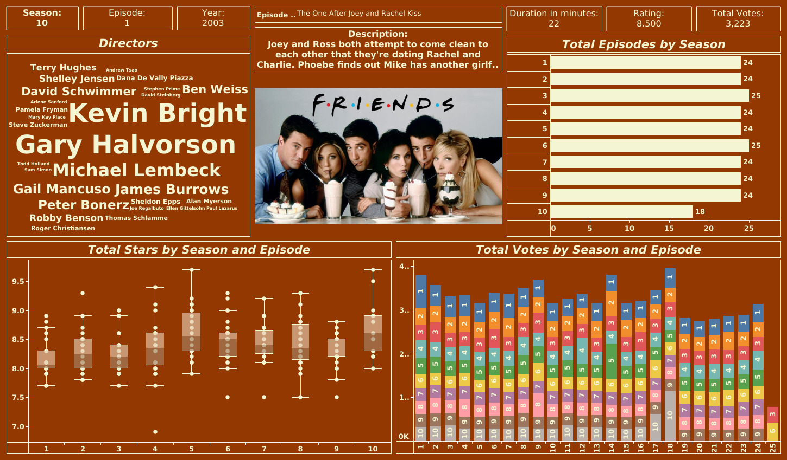

# ☕ Friends TV Show Insights

A professional Tableau analytics project designed to evaluate episode ratings, season performance, cast appearances, audience voting trends, and popularity insights from the iconic TV show *Friends*.

This dashboard helps entertainment analysts, media enthusiasts, streaming platforms, and content strategists understand viewer engagement, season success, cast impact, and sitcom popularity using data-driven insights.

---

# 📌 Business Objective

Entertainment stakeholders need visibility into episode popularity, season-wise performance, audience ratings, and cast contribution to understand content success and audience retention.

This dashboard enables stakeholders to:

- Analyze top-performing seasons and episodes  
- Monitor ratings across seasons  
- Evaluate audience voting behavior  
- Track cast appearances by season  
- Identify peak popularity periods  
- Support content strategy using analytics  

---

# 📊 Dashboard Coverage

## Show Performance Analytics

- Total episodes by season  
- Season-wise ratings analysis  
- Audience votes by episode  
- Episode duration insights  
- Trend of popularity over seasons  

## Cast & Viewer Insights

- Cast appearances by season  
- Main cast contribution trends  
- Highest rated episodes  
- Viewer engagement patterns  
- Series consistency analysis  

---

# 🔍 Key Insights

## Season Insights

- The series maintained strong ratings across all seasons, showing long-term audience loyalty.  
- Mid-to-late seasons performed exceptionally well, proving sustained content relevance.  
- Final seasons attracted stronger engagement due to storyline culmination.  
- Episode count varied by season but remained consistently high.  
- Audience ratings show minimal decline across the full run.

## Episode Insights

- Highest-rated episodes are typically finales, weddings, reunions, and major relationship moments.  
- Emotion-driven episodes generated more viewer votes than regular episodes.  
- Story arcs involving Ross & Rachel, Monica & Chandler, and Joey’s comic relief boosted engagement.  
- Special milestone episodes outperform average standalone episodes.

## Cast Insights

- Core six cast members drove consistent popularity across all seasons.  
- Ensemble balance was a major contributor to long-term success.  
- Strong chemistry among recurring cast increased rewatch value.

---

# 🛠 Tools & Skills Used

- Tableau  
- Entertainment Analytics  
- Data Visualization  
- Trend Analysis  
- Audience Segmentation  
- Dashboard Design  
- KPI Reporting  
- Comparative Analytics  
- Business Storytelling  
- Viewer Behavior Analytics  

---

# 📸 Dashboard Screenshots

## ☕ Friends Performance Dashboard

  

Provides a complete view of season ratings, episode popularity, cast appearances, and audience engagement trends.

---

# 🎯 Business Impact

This dashboard helps media stakeholders:

- Understand audience retention trends  
- Identify high-performing content formats  
- Measure season-wise popularity  
- Optimize sitcom recommendation strategy  
- Support streaming acquisition decisions  
- Improve entertainment content planning  

---

# 💡 Strategic Recommendations

- Prioritize licensing iconic sitcoms with strong rewatch value like *Friends*.  
- Promote highest-rated episodes as entry points for new viewers.  
- Use nostalgia-based campaigns targeting returning audiences.  
- Build recommendation engines around relationship-driven comedy content.  
- Analyze season finale engagement patterns for future content launches.  
- Invest in ensemble-cast shows with repeat-watch potential.

---

# 🚀 What This Project Demonstrates

- Entertainment analytics understanding  
- KPI dashboard creation  
- Audience trend analysis  
- Content performance benchmarking  
- Executive reporting mindset  
- Business storytelling with visuals  
- Viewer engagement analytics  

---

# 🔗 Connect With Me

- LinkedIn: https://www.linkedin.com/in/shaurya-nanda/  
- Portfolio: https://shauryananda3.github.io/  
- GitHub: https://github.com/shauryananda3

---
