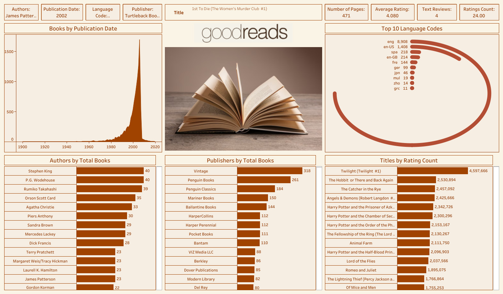

# 📚 GoodReads Book Analytics

A professional Tableau analytics project designed to evaluate book ecosystem performance across authors, publishers, languages, ratings, reviews, publication trends, and reader engagement.

This dashboard helps publishers, content platforms, retailers, and analysts understand reader preferences, top-performing titles, market demand, and publishing opportunities using data-driven insights.

---

# 📌 Business Objective

Publishing businesses and book platforms need visibility into title popularity, reader ratings, author productivity, language demand, and publisher performance to improve acquisition and growth strategy.

This dashboard enables stakeholders to:

- Analyze top-rated and most-reviewed books  
- Monitor publication trends over time  
- Compare author productivity and publisher output  
- Evaluate language-wise catalog distribution  
- Understand reader engagement using ratings counts  
- Support strategic publishing decisions using analytics

---

# 📊 Dashboard Coverage

## Publishing Performance Analytics

- Books by publication date  
- Top publishers by title count  
- Top authors by books published  
- Ratings count leaderboard  
- Reader engagement indicators  

## Reader & Market Insights

- Language distribution analysis  
- Average rating trends  
- Popular title ranking  
- Author productivity comparison  
- Market growth trends  

---

# 🔍 Key Insights (Based on Dashboard)

## 📈 Publication Trend Insights

- Book publication volume increased sharply after the 1980s.  
- Strong acceleration occurred from the late 1990s to early 2000s.  
- Peak publication years crossed **1,700+ books**, showing rapid market expansion.  
- Recent decline likely reflects incomplete dataset coverage.

## 🌍 Language Insights

- **English (eng)** dominates the catalog with **8,908 titles**.  
- **en-US** and **en-GB** follow at much lower levels.  
- Spanish, French, German, and Japanese titles show growing multilingual demand.  
- Catalog concentration suggests untapped non-English opportunities.

## ✍️ Author Insights

- **Stephen King** and **P.G. Wodehouse** lead with **40 books** each.  
- **Rumiko Takahashi** follows closely with **39 titles**.  
- Agatha Christie, Orson Scott Card, and Piers Anthony remain high-volume contributors.  
- Strong catalog depth often aligns with enduring reader loyalty.

## 🏢 Publisher Insights

- **Vintage** leads with **318 books**.  
- **Penguin Books** and **Penguin Classics** are major contributors.  
- Large legacy publishers dominate title volume.  
- Independent / niche publishers have lower representation.

## ⭐ Reader Engagement Insights

- **Twilight** ranks #1 by ratings count (**4.59M+ ratings**).  
- **The Hobbit**, **The Catcher in the Rye**, and multiple **Harry Potter** titles dominate engagement.  
- Popular franchises consistently outperform standalone titles.  
- YA / fantasy categories show powerful community-driven demand.

## 📖 Quality Indicators

- Example title shown carries **4.08 average rating**, indicating strong reader satisfaction.  
- High rating counts combined with strong averages represent long-term evergreen content.

---

# 💡 Specific Recommendations (Dashboard Driven)

## Publishing Strategy

- Increase investment in fantasy, YA, and franchise-oriented content due to strong engagement patterns.  
- Acquire multi-book series with sequel potential.  
- Build backlist monetization plans for evergreen classics.

## Global Growth Strategy

- Expand Spanish, French, German, and Japanese catalogs.  
- Launch localized marketing campaigns in non-English reader markets.  
- Prioritize translation rights acquisition for top-performing titles.

## Author Strategy

- Partner with prolific authors who sustain repeat readership.  
- Use high-output authors for subscription / recurring content ecosystems.  
- Develop emerging writers into series brands.

## Reader Retention Strategy

- Recommend franchise-based reading journeys (Harry Potter, Twilight-style ecosystems).  
- Curate genre collections to improve discovery and engagement.  
- Use ratings + review counts to power recommendation engines.

## Commercial Optimization

- Promote classics and evergreen titles during seasonal campaigns.  
- Bundle series titles for higher basket size.  
- Focus acquisition budget on titles with strong ratings + social traction.

---

# 🛠 Tools & Skills Used

- Tableau Desktop  
- Tableau Public  
- Publishing Analytics  
- Data Visualization  
- Consumer Behavior Analytics  
- KPI Reporting  
- Dashboard Design  
- Trend Analysis  
- Business Storytelling  
- Market Intelligence  

---

# 📸 Dashboard Screenshots

## 📚 GoodReads Executive Overview

  

Provides a complete view of authors, publishers, languages, publication trends, ratings, and reader engagement.

---

# 🎯 Business Impact

This dashboard helps publishing stakeholders:

- Improve title acquisition decisions  
- Identify high-demand genres and franchises  
- Expand into multilingual markets  
- Optimize author partnership strategy  
- Increase reader engagement and retention  
- Enable smarter portfolio planning

---

# 🚀 What This Project Demonstrates

- Publishing analytics understanding  
- KPI dashboard creation  
- Reader behavior analysis  
- Market trend reporting  
- Author / publisher performance insights  
- Business storytelling with visuals  
- Strategic recommendation capability

---

# 🔗 Connect With Me

- LinkedIn: https://www.linkedin.com/in/shaurya-nanda/  
- Portfolio: https://shauryananda3.github.io/  
- GitHub: https://github.com/shauryananda3

---
