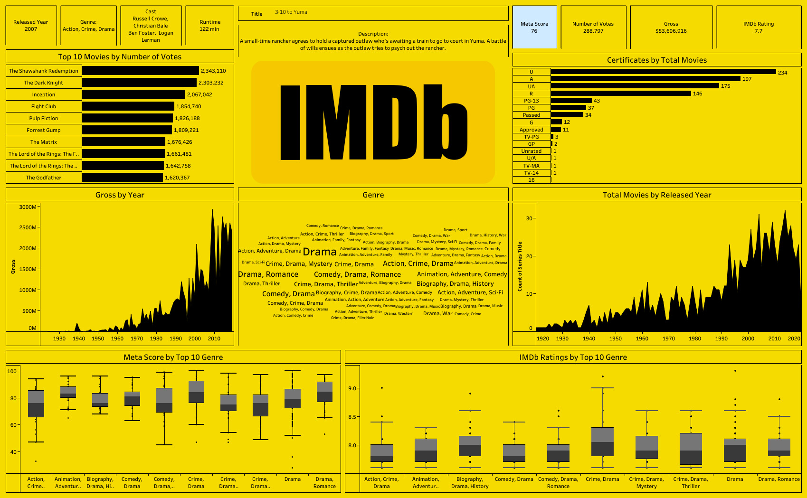

# ⭐ IMDb Movie Analytics

A professional Tableau analytics project designed to evaluate movie performance across ratings, votes, revenue, genres, certificates, release trends, and audience engagement.

This dashboard helps studios, streaming platforms, content strategists, and analysts understand audience preferences, profitable genres, long-term industry growth, and content investment opportunities.

---

# 📌 Business Objective

Entertainment businesses need visibility into movie ratings, popularity trends, revenue growth, and genre performance to optimize production decisions and maximize returns.

This dashboard enables stakeholders to:

- Analyze top-rated and most-voted movies  
- Monitor gross revenue trends over time  
- Compare genre performance using ratings and metascores  
- Evaluate certification-wise movie distribution  
- Understand release year production trends  
- Support strategic content planning using analytics

---

# 📊 Dashboard Coverage

## Movie Performance Analytics

- IMDb rating analysis  
- Number of votes ranking  
- Gross revenue by year  
- Total movies by released year  
- Individual movie performance cards  

## Audience & Genre Insights

- Genre popularity cloud  
- Top genre ratings comparison  
- Metascore by genre  
- Certification distribution  
- Audience engagement trends  

---

# 🔍 Key Insights (Based on Dashboard)

## 🎬 Audience Popularity Insights

- **The Shawshank Redemption** ranked #1 by votes (**2.34M+ votes**).  
- **The Dark Knight** and **Inception** followed closely, showing strong fan engagement.  
- Cult classics and franchise films consistently dominate audience participation.

## 💰 Revenue Trend Insights

- Movie gross revenue accelerated sharply after the 1990s.  
- Major box-office peaks occurred after 2000, indicating globalization of cinema markets.  
- Recent decades generated significantly higher revenue than earlier eras.

## 📈 Production Trend Insights

- Total movies released increased steadily over time.  
- Strong growth occurred after the 1990s.  
- Peak production years crossed **30+ titles** in dataset periods.

## 🎭 Genre Insights

- **Drama** appeared as the most dominant genre cluster.  
- Action, Crime, Romance, Biography, and Comedy were also strongly represented.  
- Multi-genre combinations were common among successful films.

## ⭐ Ratings Insights

- **Crime / Drama** combinations showed some of the strongest IMDb rating consistency.  
- Biography and Drama-related genres maintained higher median ratings.  
- Romance / Drama also performed strongly.

## 🏅 Metascore Insights

- Biography, Crime, Drama, and Romance combinations showed strong critic reception.  
- Wide spread in some genres suggests inconsistent quality output.

## 🔞 Certification Insights

- **U / A / UA / R** categories dominated total movie counts.  
- Family-friendly and mass-market certificates had strong representation.  
- Mature-rated films also remained commercially significant.

---

# 💡 Specific Recommendations (Dashboard Driven)

## Content Investment Strategy

- Increase investment in **Drama, Crime, Biography, and Action** genres due to strong audience + critic balance.  
- Develop multi-genre storytelling formats which show strong popularity patterns.  
- Use proven genre combinations for lower-risk productions.

## Audience Growth Strategy

- Promote nostalgia and cult-classic catalogs since legacy titles continue driving engagement.  
- Use top-voted titles for recommendation engines and marketing hooks.  
- Build fan communities around franchise-style high-engagement content.

## Revenue Optimization

- Focus on globally scalable genres such as Action / Drama / Thriller.  
- Allocate larger budgets to genres with both rating strength and commercial history.  
- Re-release / remaster classic top-voted films for monetization.

## Platform Strategy

- Use IMDb ratings + votes as demand signals for acquisition/licensing.  
- Balance prestige cinema (high metascore) with mass appeal content.  
- Curate genre-specific collections for better user retention.

## Portfolio Planning

- Reduce low-performing niche content with weak ratings and low engagement.  
- Maintain annual slate mix of blockbuster + awards-focused + mid-budget films.

---

# 🛠 Tools & Skills Used

- Tableau Desktop  
- Tableau Public  
- Entertainment Analytics  
- Data Visualization  
- KPI Reporting  
- Trend Analysis  
- Dashboard Design  
- Consumer Behavior Analytics  
- Business Storytelling  
- Statistical Comparison  

---

# 📸 Dashboard Screenshots

## ⭐ IMDb Executive Overview

  

Provides a complete view of ratings, votes, genres, certificates, gross trends, and movie release analytics.

---

# 🎯 Business Impact

This dashboard helps entertainment stakeholders:

- Improve content investment decisions  
- Identify profitable genres  
- Understand audience engagement behavior  
- Optimize platform acquisition strategy  
- Balance critic vs commercial content mix  
- Enable smarter portfolio decisions

---

# 🚀 What This Project Demonstrates

- Entertainment analytics understanding  
- KPI dashboard creation  
- Audience behavior analysis  
- Genre performance reporting  
- Revenue trend intelligence  
- Business storytelling with visuals  
- Strategic recommendation capability

---

# 🔗 Connect With Me

- LinkedIn: https://www.linkedin.com/in/shaurya-nanda/  
- Portfolio: https://shauryananda3.github.io/  
- GitHub: https://github.com/shauryananda3

---
