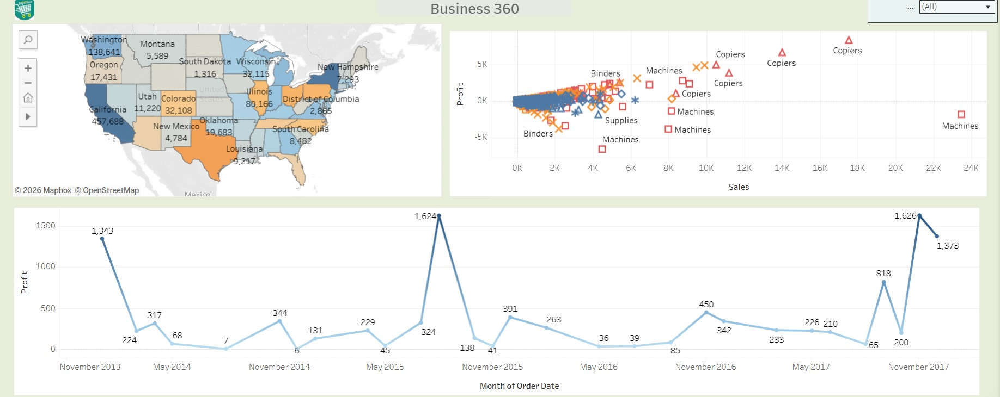
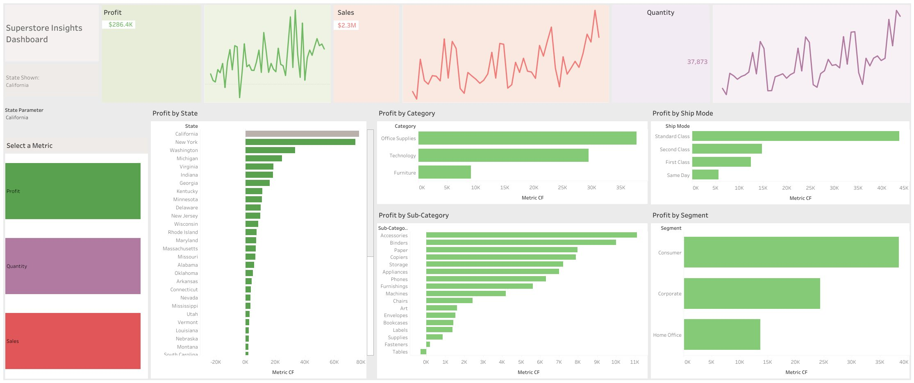
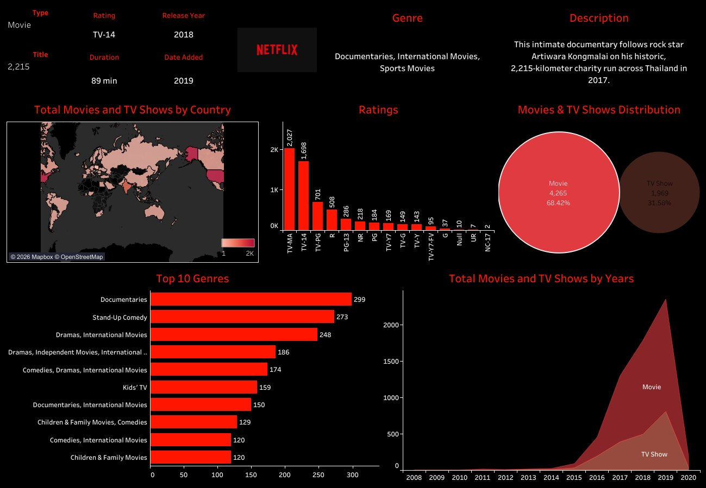
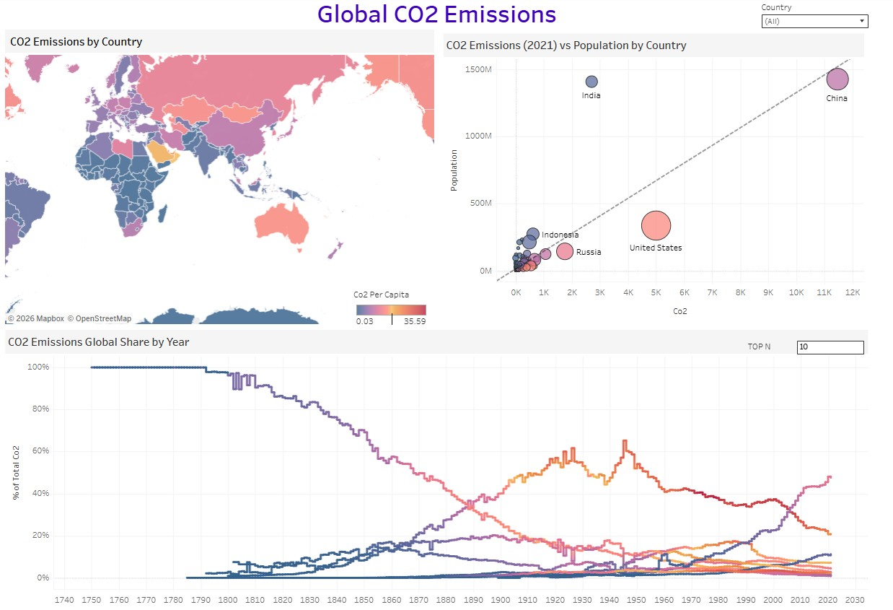

# 📊 Tableau Analytics Projects Portfolio

A premium collection of interactive Tableau dashboards built across multiple industries including business intelligence, retail, entertainment, environment, and consumer analytics.

This repository showcases practical dashboarding capabilities including KPI reporting, trend analysis, storytelling, and executive-level business insights.

---

# 🚀 Portfolio Highlights

✅ Interactive Tableau Dashboards  
✅ Cross-Industry Analytics Projects  
✅ Executive KPI Reporting  
✅ Business Storytelling with Visuals  
✅ Strong Dashboard Design Skills  
✅ Insight-Driven Decision Making

---

# 🛠 Tools & Skills Used

- Tableau Desktop  
- Tableau Public  
- Dashboard Design  
- KPI Reporting  
- Filters & Parameters  
- Trend Analysis  
- Storytelling with Data  
- Data Visualization  
- Business Intelligence  

---

# 🌟 Featured Dashboards

## 💼 Business 360

  

Executive dashboard for sales, profitability, regional performance, and customer trends.

---

## 🛒 Superstore Insights

  

Retail dashboard analyzing sales, profit, quantity, state trends, and category performance.

---

## 🎬 Netflix Content Analytics

  

Tracks movies vs TV shows, ratings, genres, release trends, and content distribution.

---

## 🌍 Global CO2 Emissions

  

Analyzes emissions by country, population, per-capita contribution, and global climate trends.

---

# 📂 Current Project Portfolio

| Project Name | Domain |
|-------------|--------|
| Business 360 | Business Intelligence |
| Superstore Insights | Retail |
| Netflix Content Analytics | Entertainment |
| Global CO2 Emissions | Environment |

---

# 🎯 What This Portfolio Demonstrates

- Tableau Dashboard Development  
- Interactive Visualization  
- Executive Reporting  
- Cross-Domain Analytics  
- Business Decision Support  
- Storytelling with Data  
- Analytical Thinking  

---

# 🔗 Connect With Me

- LinkedIn: https://www.linkedin.com/in/shaurya-nanda/  
- Portfolio Website: https://shauryananda3.github.io/  
- GitHub: https://github.com/shauryananda3  

---

# ⭐ Explore the dashboards and connect for opportunities.
