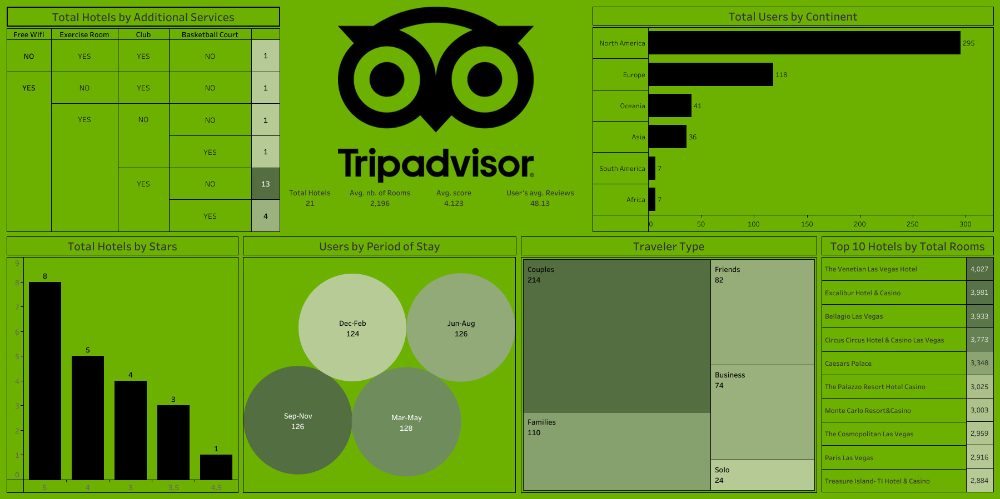

# ✈️ TripAdvisor Insights

A professional Tableau analytics project designed to evaluate hotel performance, traveler behavior, customer ratings, seasonal demand patterns, and hospitality market trends.

This dashboard helps hotel owners, travel businesses, hospitality managers, and tourism analysts understand customer preferences, optimize hotel services, and improve occupancy strategy using data-driven insights.

---

# 📌 Business Objective

Travel and hospitality stakeholders need visibility into traveler segments, hotel quality perception, seasonal demand, and service preferences to improve guest satisfaction and revenue performance.

This dashboard enables stakeholders to:

- Analyze traveler type behavior  
- Monitor hotel ratings and star distribution  
- Evaluate demand across stay periods  
- Understand regional user engagement  
- Benchmark hotels by room capacity  
- Improve service offerings using customer trends  

---

# 📊 Dashboard Coverage

## Hotel Performance Analytics

- Total hotels overview  
- Average hotel score analysis  
- Average rooms per hotel  
- Top hotels by total rooms  
- Hotel star rating distribution  

## Traveler & Market Insights

- Users by continent  
- Traveler type segmentation  
- Seasonal stay period demand  
- Additional services analysis  
- Customer review behavior  

---

# 🔍 Key Insights

## Hotel Insights

- Total hotels analyzed: **21** with an average score of **4.12**, indicating generally strong customer satisfaction.  
- Average hotel size is **2,196 rooms**, showing concentration in large-scale hospitality properties.  
- The Venetian Las Vegas Hotel leads room capacity with **4,027 rooms**, followed closely by Excalibur and Bellagio.  
- Majority of listed hotels fall under **5-star and 4-star categories**, highlighting premium market concentration.  
- Lower representation of 3-star and below properties suggests stronger luxury positioning.

## Traveler Insights

- **North America dominates demand with 295 users**, significantly ahead of Europe (118).  
- Couples are the largest traveler segment (**214 users**), followed by Families (**110**).  
- Solo travelers represent the smallest segment, indicating lower single-travel focus.  
- Stay demand remains balanced across all periods, with **Mar-May highest at 128 users**.  
- Seasonal variation is relatively stable, supporting year-round demand opportunities.

## Service Insights

- Free WiFi and club access appear among commonly preferred hotel amenities.  
- Hotels with multiple amenities likely attract higher-value traveler segments.  
- Premium facilities can improve ratings and review counts.

---

# 🛠 Tools & Skills Used

- Tableau  
- Data Visualization  
- Hospitality Analytics  
- Customer Segmentation  
- Dashboard Design  
- KPI Reporting  
- Trend Analysis  
- Business Storytelling  
- Market Intelligence  
- Consumer Behavior Analytics  

---

# 📸 Dashboard Screenshots

## ✈️ TripAdvisor Overview Dashboard

  

Provides a complete view of hotel ratings, traveler segments, seasonal demand, amenities, and market trends.

---

# 🎯 Business Impact

This dashboard helps hospitality stakeholders:

- Improve traveler targeting strategy  
- Optimize hotel amenities and offerings  
- Benchmark large hotels vs competitors  
- Increase occupancy during slower periods  
- Improve guest satisfaction ratings  
- Strengthen pricing and market strategy  

---

# 💡 Strategic Recommendations

- Launch **couples-focused packages**, as they form the largest customer segment.  
- Create **family vacation bundles** during peak seasonal periods.  
- Expand campaigns in **Europe and Asia** to diversify demand beyond North America.  
- Promote amenities like **WiFi, club access, fitness rooms**, and premium services in marketing.  
- Use dynamic pricing during high-demand periods (Mar-Aug).  
- Encourage solo and business travelers through loyalty offers and weekday discounts.  
- Benchmark smaller hotels against top room-capacity leaders for expansion planning.

---

# 🚀 What This Project Demonstrates

- Hospitality analytics understanding  
- Customer segmentation capability  
- KPI dashboard creation  
- Seasonal demand analysis  
- Executive reporting mindset  
- Business storytelling with visuals  
- Consumer behavior analytics  

---

# 🔗 Connect With Me

- LinkedIn: https://www.linkedin.com/in/shaurya-nanda/  
- Portfolio: https://shauryananda3.github.io/  
- GitHub: https://github.com/shauryananda3

---
