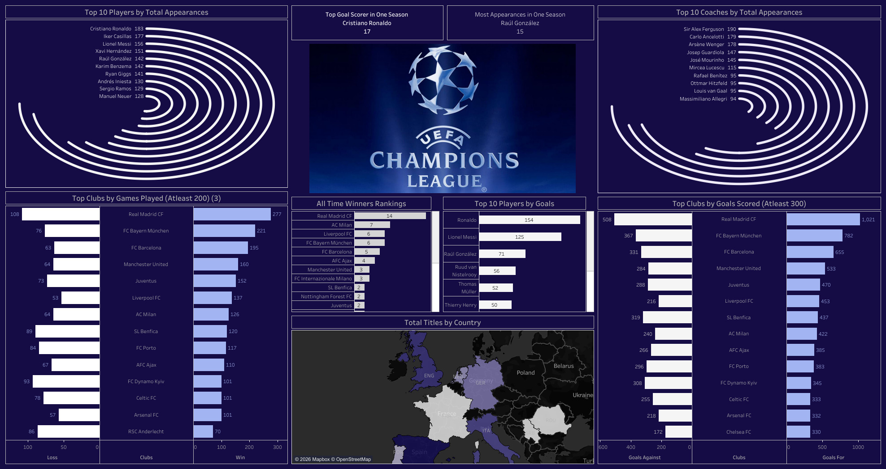

# ⚽ UEFA Analytics

A professional Tableau analytics project designed to evaluate football club performance, goal scoring trends, player contribution, competition rankings, and UEFA tournament insights.

This dashboard helps sports analysts, clubs, coaches, and football enthusiasts understand team dominance, scoring efficiency, player impact, and competitive performance using data-driven insights.

---

# 📌 Business Objective

Football stakeholders need visibility into club performance, player output, scoring trends, and competition rankings to improve strategic planning and performance benchmarking.

This dashboard enables stakeholders to:

- Analyze top clubs by goals scored  
- Monitor club wins and competition performance  
- Evaluate player goal contributions  
- Compare historical rankings  
- Identify elite-performing clubs  
- Support strategic football analysis using data  

---

# 📊 Dashboard Coverage

## Club Performance Analytics

- Top clubs by goals scored  
- Club wins by tournament season  
- Historical club rankings  
- Goals by competition period  
- Multi-club comparison insights  

## Player & Tournament Insights

- Top players by goals  
- Team contribution trends  
- Seasonal performance movement  
- Competition dominance patterns  
- UEFA tournament analytics  

---

# 🔍 Key Insights

## Club Insights

- Leading European clubs dominate both goals scored and win counts across seasons.  
- A small group of elite clubs consistently outperform the broader competition.  
- Historical rankings show sustained success from clubs with strong squad depth.  
- Goal output is concentrated among top-performing clubs rather than evenly distributed.  
- Tournament consistency is a stronger success indicator than one-season spikes.

## Player Insights

- Top scorers significantly influence club advancement and ranking position.  
- Clubs with multiple contributing scorers outperform one-player dependent teams.  
- Consistent player performance across seasons creates long-term dominance.  
- Elite attackers remain central to UEFA competition success.

## Tournament Insights

- Certain seasons show clear dominance cycles by a few clubs.  
- Rankings fluctuate more for mid-tier clubs than top-tier clubs.  
- Competitive balance narrows in knockout stages.

---

# 🛠 Tools & Skills Used

- Tableau  
- Sports Analytics  
- Data Visualization  
- Ranking Analysis  
- Performance Benchmarking  
- Dashboard Design  
- KPI Reporting  
- Trend Analysis  
- Business Storytelling  
- Comparative Analytics  

---

# 📸 Dashboard Screenshots

## ⚽ UEFA Performance Dashboard

  

Provides a complete view of club rankings, goals scored, player contribution, and tournament dominance trends.

---

# 🎯 Business Impact

This dashboard helps football stakeholders:

- Benchmark club performance vs competitors  
- Evaluate scoring efficiency trends  
- Identify dominant teams and eras  
- Analyze player contribution impact  
- Improve recruitment and squad planning  
- Support strategic sports decisions  

---

# 💡 Strategic Recommendations

- Build squads with **multiple scoring threats** rather than reliance on one striker.  
- Use historical ranking trends to benchmark long-term club strategy.  
- Prioritize player rotation to maintain consistency across seasons.  
- Study elite clubs’ patterns in knockout stages for tactical improvement.  
- Invest in youth pipelines to sustain multi-year competitiveness.  
- Focus recruitment on positions linked to goal creation and finishing.

---

# 🚀 What This Project Demonstrates

- Sports analytics understanding  
- KPI dashboard creation  
- Ranking trend analysis  
- Competitive benchmarking capability  
- Executive reporting mindset  
- Business storytelling with visuals  
- Performance strategy analytics  

---

# 🔗 Connect With Me

- LinkedIn: https://www.linkedin.com/in/shaurya-nanda/  
- Portfolio: https://shauryananda3.github.io/  
- GitHub: https://github.com/shauryananda3

---
